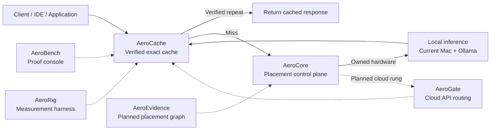

<div align="center">

# AERO


### Provably-correct exact-match caching and cost-ordered placement for LLM inference

Skip repeated deterministic inference. Route new work to the cheapest capable backend.

[Overview](#overview) · [How it works](#how-it-works) · [Architecture](#architecture) · [Status](#project-status) · [Roadmap](#roadmap)

</div>

---

## Overview

Aero is an inference infrastructure project for reducing the cost and latency of repeated LLM workloads without weakening correctness.

For an eligible deterministic request, Aero can return a previously generated response only after confirming that the live request matches the stored request exactly. When exactness cannot be established, Aero does not guess—it treats the request as a miss or bypass and sends it to an inference backend.

After a cache miss, Aero uses a cost-ordered placement model:

1. **Verified exact cache** — reuse an identical deterministic result without running model generation again.
2. **Owned local inference** — use available hardware already under your control.
3. **Cloud inference** — use paid providers only when local capacity or capability is insufficient.

Aero keeps exact caching and approximate optimizations behind a strict correctness boundary.

---

## Why Aero

LLM workloads commonly repeat work through retries, automated agents, evaluation reruns, classification pipelines, extraction jobs, and duplicated requests. Recomputing the same deterministic answer wastes latency, compute, and money.

Aero addresses two separate optimization problems:

| Optimization             | What it reuses                                | Result                                                                         |
| ------------------------ | --------------------------------------------- | ------------------------------------------------------------------------------ |
| **Exact-match caching**  | The entire deterministic request and response | Skips model generation when the request repeats exactly                        |
| **Prefix-aware routing** | A shared prompt prefix                        | Still generates a new response while attempting to reuse provider-side context |

Exact-match caching is implemented as Aero's guaranteed Tier A path. Prefix-aware routing remains a separate planned optimization and cannot affect the exactness guarantee.

---

## How It Works

```text
Request
  │
  ├─ Is it eligible for deterministic caching?
  │      └─ No → bypass the exact-cache path
  │
  ├─ Build a canonical, fingerprinted request identity
  │
  ├─ Check the cache hierarchy
  │      ├─ Verified match → return the stored response
  │      └─ Miss or mismatch → continue normally
  │
  ├─ Ask the placement layer for the cheapest capable backend
  │
  └─ Run inference, return the response, and write back eligible results
```

The core safety rule is simple:

> If Aero cannot prove that a cached response belongs to the exact live request, it does not serve that response.

Failures are handled with a fail-open design. If caching or placement is unavailable, inference continues through the configured upstream instead of turning Aero into a new outage dependency.

---

## Correctness Boundary

Aero separates guaranteed and approximate behavior into two explicit tiers.

| Tier       | Behavior                                                                                                         | Guarantee                                                     |
| ---------- | ---------------------------------------------------------------------------------------------------------------- | ------------------------------------------------------------- |
| **Tier A** | Deterministic gating, canonical request identity, fingerprinted namespaces, store-and-verify, epoch invalidation | Exact response reuse only                                     |
| **Tier B** | Semantic matching, heuristic routing, prefix warmth, or other approximate techniques                             | Optional, separately measured, never allowed to weaken Tier A |

This boundary is a system constraint, not a UI label. Approximate behavior must remain opt-in, observable, and isolated from the exact-cache claim.

---

## Architecture



### Placement ladder

| Rung                    | Role                                         | Cost model                    |
| ----------------------- | -------------------------------------------- | ----------------------------- |
| **0 — Exact cache**     | Serve a verified deterministic repeat        | No new model generation       |
| **1 — Local inference** | Use owned compute when capable               | Sunk hardware cost            |
| **2 — Cloud inference** | Use external providers for heavier workloads | Per-token or provider pricing |

---

## Repository Map

The repository is organized as a set of focused components. Detailed APIs, setup instructions, commands, environment variables, and tests belong in each component's own README.

| Component        | Responsibility                                                                       | State            |
| ---------------- | ------------------------------------------------------------------------------------ | ---------------- |
| **AeroCache**    | OpenAI-compatible exact-cache data plane                                             | Built and tested |
| **AeroBench**    | Proof-oriented frontend for observing misses, verified hits, receipts, and telemetry | Built and tested |
| **AeroCore**     | Deterministic backend placement and routing control plane                            | Built and tested |
| **AeroRig**      | Probes, benchmark suites, normalized matrices, and cache-versus-direct measurement   | Built and tested |
| **AeroEvidence** | Capability, cost, latency, and placement graph                                       | Planned          |
| **AeroFleet**    | Formal local-worker registration and live capacity telemetry                         | Planned          |
| **AeroGate**     | Cloud-provider routing, fallback, limits, and cost control                           | Planned          |

---

## Project Status

The current core has been built, integrated, and exercised on real hardware:

* AeroCache, AeroBench, AeroCore, their miss-path integration, and AeroRig are complete enough to remain frozen unless defects are found.
* AeroCache runs continuously on a repurposed Ubuntu Trojan server.
* Valkey provides persistent local cache storage on the Trojan host.
* M2 running Ollama currently provides the local inference backend.
* Verified first-miss and second-hit behavior has been demonstrated, including cache persistence across an AeroCache restart.
* The live lab is exposed privately through Cloudflare Tunnel and Cloudflare Access without router port forwarding.
* The public website remains separate from the protected live inference environment.

The formal `docs/correctness.md` artifact must be confirmed and frozen before the public “provably-correct” claim is treated as externally complete.

---

## Design Principles

### Correctness before hit rate

A lower exact hit rate is preferable to serving an answer that cannot be proven to match the request.

### Fail open

Cache, control-plane, or dependency failure must not block normal inference.

### Scope matches the claim

Aero is infrastructure for exact response reuse and cost-ordered inference placement. It is not a chat product, memory layer, semantic knowledge system, or general-purpose distributed-compute platform.

### Measurement over marketing

Latency, hit ratio, cost savings, bypasses, and failure cases must be measured and reported. Cases where exact caching does not help should remain visible.

---

## Roadmap

1. Confirm and freeze the formal correctness documentation.
2. Complete credential rotation and repository-history hygiene.
3. Run AeroCore as a managed service on the Lenovo host and enable live miss placement.
4. Build AeroEvidence with context-aware and memory-aware capability checks.
5. Formalize the Mac worker through AeroFleet telemetry.
6. Add AeroGate for controlled cloud routing and fallback.
7. Add Context-Anchor Routing as a separately evaluated prefix-aware layer.
8. Publish the cache-versus-prefix-routing crossover benchmark using a reproducible vLLM/GPU test arm.

---

## Security and Deployment Notes

* Local environment files, runtime data, logs, backups, API keys, and Cloudflare credentials must not be committed.
* Any credential previously exposed in an example file or Git history must be rotated and scrubbed.
* Public users should never receive unrestricted access to raw AeroCache or local inference endpoints.
* A public demonstration requires authentication, rate limits, prompt and token caps, a fixed model, deterministic settings, and controlled fallback behavior.

---

## Website

Project overview and public demonstration material:

**https://go-aero.net**

---

<div align="center">

**Correctness at rung zero. Cost-aware placement after the miss.**

</div>
